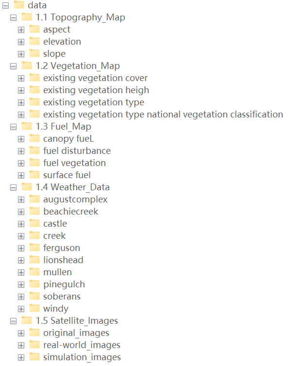

# Sim2Real-Fire

**Sim2Real-Fire: A Multi-modal Simulation Dataset for Forecast and Backtracking of Real-world Forest Fire**

### Sim2Real-Fire Dataset

We uploaded the complete data set in packages. See the catalogue below.

- **simulation data**
  - [simulation_data_01](https://drive.google.com/drive/folders/1uSzsHcjtZeZvW76SSatxR5r2ps5KizEJ?usp=sharing)
  - [simulation_data_02](https://drive.google.com/drive/folders/18QY858nhxsnsa1ZytIaVkuhQZgIN7jGj?usp=sharing)
  - simulation_data_03
  - simulation_data_04
  - simulation_data_05
  - simulation_data_06
- **real-world data**
  - realworld_data_01
  - realworld_data_02
  - realworld_data_03
  - realworld_data_04

### Step-by-Step Guide Video
The following video provides a comprehensive overview of how we created and integrated the dataset:
[](assets/preprocess.mp4)


## Getting Started

<p align="center">
     
     <br/> S2R-FireTr forecasts wildfires by predicting future target fire areas based on source fire areas. (a) During the environment-guided area representation learning, we input the source fire areas and multi-modal environmental information into the transformer to compute the source area presentation A. (b) During the time-wise fire area regression, we input the source area presentation A and the target timestamp into the transformer to compute the target area presentation R for predicting the target fire areas. "Shifted Later" means that we concatenate the source and target areas to predict later areas. Source and target areas can be interchanged, creating a pipeline for wildfire backtracking.
</p>


### Sim2Real-Fire Dataset

We create a brand-new **Sim2Real-Fire Dataset** dataset contains wildfire simulation and real-world data, including **1M** and **1K** wildfire scenarios. Each scenario is associated with five data modalities of environmental information, including topography, vegetation, fuel maps, weather data, and satellite images with the annotated fire regions.

We provide a **mini-version** of the dataset in [Sim2Real-Fire](https://1drv.ms/f/s!AhX2uIQNmngrafE5KFjNyZym_7o?e=yo3Q1K)

Below is the directory structure of the Sim2Real-Fire dataset:
<p align="left">
  
</p>

Here, we present some examples of satellite images with the real fire areas. The complete collection is available in the directory 1.5_Satellite_Images/original_images. 


<p align="center">
  
  <br/> Examples of satellite images with the real fire areas.
</p>


<br>

<p align="center">
  
  <br/> Topography, vegetation, fuel, weather, and the satellite data in the Sim2Real-Fire dataset.
</p>

<br>

<p align="center">
     
     <br/> (a) Distribution of vegetation covers and types. (b) Distribution of fuel types. (c) Distribution topography data. (d) Distribution of weather data.
</p>


### Install dependencies
To set up the environment, install the dependencies using the following command:
```sh
pip install -r requirements.txt
```

### Training

To train the S2R-FireTr model on the Sim2Real-Fire simulation data:

1. **Configure the Training Parameters:**
   - Open the `config.yaml` file and adjust the training parameters, including learning rate, batch size, number of epochs, and dataset paths.
   - **Important:** Make sure to update the paths to the simulation data and real-world data in the `config.yaml` file according to your local file structure.

2. **Start Training:**
   - Run the training script with the following command:
   ```sh
   python train.py --config config.yaml
   ```
   - This will start the training process using the simulation data defined in the configuration file. During training, checkpoints will be saved periodically, and training logs will be outputted for monitoring.

### Testing

To test the trained S2R-FireTr model on the Sim2Real-Fire real-world data:

1. **Configure the Testing Parameters:**
   - Adjust the testing configuration in `config.yaml`, including paths to the trained model checkpoint and testing data.
   - **Important:** Ensure that the dataset paths in the `config.yaml` file point to the correct location of the test dataset on your system.

2. **Run the Testing Script:**
   - Use the following command to start testing:
   ```sh
   python test.py --config config.yaml
   ```
   - The script will load the trained model and evaluate it on the specified real-world data. The results, including performance metrics and visualizations. These visualizations, along with the evaluation metrics, will be stored in the designated output directory for further analysis and presentation.

3. **Evaluate Model Performance:**
   - After testing, review the output directory to analyze both the quantitative metrics and the qualitative visualizations to assess the model’s performance on real-world fire data.
