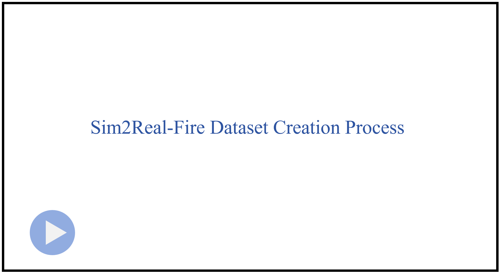

# Sim2Real-Fire

**Sim2Real-Fire: A Multi-modal Simulation Dataset for Forecast and Backtracking of Real-world Forest Fire**

### Sim2Real-Fire Dataset

We have uploaded the complete dataset in packages. Please refer to the directory list below.

Each package is named in the format `xxxx_xxxxx`, where:
- The **first four digits (`xxxx`)** represent the **scene ID**.
- The **last five digits (`xxxxx`)** indicate the **number of fire events** under that specific scene.

For example, in the file name `0001_02614`, `0001` refers to the scene ID, and `02614` means there are 2,614 fire events under this scene.

- **simulation data**
  - [**simulation_data_01**(Scene range: `0001_02614` to `0019_01316`)](https://drive.google.com/drive/folders/1uSzsHcjtZeZvW76SSatxR5r2ps5KizEJ?usp=sharing)
  - [**simulation_data_02**(Scene range: `0020_00970` to `0046_02758`)](https://drive.google.com/drive/folders/18QY858nhxsnsa1ZytIaVkuhQZgIN7jGj?usp=sharing)
  - [**simulation_data_03**(Scene range: `0047_05424` to `0068_03539`)](https://drive.google.com/drive/folders/1OdNSsGkB4ZpPEDSbSi6fQbQ0IbcpVTiy?usp=sharing)
  - [**simulation_data_04**(Scene range: `0069_03539` to `0077_11679`)](https://drive.google.com/drive/folders/1hR8mvVKCpswmYtsH7BR8PiZHaICJ8Apb?usp=sharing)
  - [**simulation_data_05**(Scene range: `0078_14685` to `0084_02609`)](https://drive.google.com/drive/folders/1enqv5xdJ_fsBpt5e7wCt9R-8JOBPhFaP?usp=sharing)
  - [**simulation_data_06**(Scene range: `0085_02466` to `0114_02292`)](https://drive.google.com/drive/folders/1CauT4UIMy0Ckc4uTZFyQ2v9XMtvewKcD?usp=drive_link)
  - [**simulation_data_07**(Scene range: `0115_02715` to `0130_01761`)](https://drive.google.com/drive/folders/1nMJ7VS72EbANUVRzpFxF4q4XgDBTvt_6)
  - [**simulation_data_08**(Scene range: `0131_02592` to `0152_02969`)](https://drive.google.com/drive/folders/1G8zZAuebZIlo_jB_3I5RZGIDvXK50k6P?usp=sharing)
  - [**simulation_data_09**(Scene range: `0153_00235` to `0168_03137`)](https://drive.google.com/drive/folders/1kQlamHitO_B-hK3KGHjLIfFO_kiu1iWS?usp=drive_link)
  - [**simulation_data_10**(Scene range: `0169_23343` to `0177_01629`)](https://drive.google.com/drive/folders/1j7Xi71W7HL1FrredUc-g6CMVTTb3Us2o?usp=sharing)
  - [**simulation_data_11**(Scene range: `0178_08498` to `0181_07922`)](https://drive.google.com/drive/folders/137Ix90KidXb4M_Sh73te9ExAHOhMGWyd?usp=sharing)
  - [**simulation_data_12**(Scene range: `0182_25232` to `0198_00609`)](https://drive.google.com/drive/folders/1k2InB5J_d7iNA-jelfgDi88y3dgeqZnJ?usp=sharing)
  - [**simulation_data_13**(Scene range: `0199_13351` to `0213_01983`)](https://drive.google.com/drive/folders/1n9kwjp7Ve-4-IXE8tYluRe-k8Uh1ZodZ?usp=sharing)
  - [**simulation_data_14**(Scene range: `0214_02091` to `0242_02940`)](https://drive.google.com/drive/folders/1sJLoQfHnCACbgnGiYn7Uj9MN6FJuTah6?usp=drive_link)
  - [**simulation_data_15**(Scene range: `0243_02722` to `0260_03391`)](https://drive.google.com/drive/folders/1s-YQ6mHinZ6wmD_BBCfL1xhJs3gUdzti?usp=drive_link)
  - [**simulation_data_16**(Scene range: `0261_02900` to `0282_03685`)](https://drive.google.com/drive/folders/1JLB2QXaxUmq-OEm01v5omHPtzt5fw0Yw?usp=sharing)
  - [**simulation_data_17**(Scene range: `0283_00606` to `0310_02903`)](https://drive.google.com/drive/folders/1vJY3gkwuO7J_AyMxDTI4OELnMrYpXEoq?usp=drive_link)
  - [**simulation_data_18**(Scene range: `0311_01395` to `0328_02411`)](https://drive.google.com/drive/folders/1yYPsRzQy9OWBSZWJVmVldjp__FjUe1Tl?usp=drive_link)
  - [**simulation_data_19**(Scene range: `0329_02902` to `0349_03066`)](https://drive.google.com/drive/folders/1W2vtrZmfu_L9tvB4ro4OL1Fjka18fzOS?usp=drive_link)
  - [**simulation_data_20**(Scene range: `0350_03311` to `0351_00343`)](https://drive.google.com/drive/folders/1AZHn5a8GraWjGlbGDX3fRwibqJ0vOaiO?usp=sharing)
- **real-world data**
  - [**realworld_data_01**](https://drive.google.com/drive/folders/1QJbNu35VzCCDOhkc3bn5guIoLEyA0cRF?usp=drive_link)
  - realworld_data_02
  - realworld_data_03
  - realworld_data_04

### Step-by-Step Guide Video
The following video provides a comprehensive overview of how we created and integrated the dataset:
[](assets/preprocess.mp4)


## Getting Started

<p align="center">
     
     <br/> S2R-FireTr forecasts wildfires by predicting future target fire areas based on source fire areas. (a) During the environment-guided area representation learning, we input the source fire areas and multi-modal environmental information into the transformer to compute the source area presentation A. (b) During the time-wise fire area regression, we input the source area presentation A and the target timestamp into the transformer to compute the target area presentation R for predicting the target fire areas. "Shifted Later" means that we concatenate the source and target areas to predict later areas. Source and target areas can be interchanged, creating a pipeline for wildfire backtracking.
</p>


### Sim2Real-Fire Dataset

We create a brand-new **Sim2Real-Fire Dataset** dataset contains wildfire simulation and real-world data, including **1M** and **1K** wildfire scenarios. Each scenario is associated with five data modalities of environmental information, including topography, vegetation, fuel maps, weather data, and satellite images with the annotated fire regions.

We provide a **mini-version** of the dataset in [Sim2Real-Fire](https://1drv.ms/f/s!AhX2uIQNmngrafE5KFjNyZym_7o?e=yo3Q1K)

Here, we present some examples of satellite images with the real fire areas. The complete collection is available in the directory 1.5_Satellite_Images/original_images. 


<p align="center">
  
  <br/> Examples of satellite images with the real fire areas.
</p>


<br>

<p align="center">
  
  <br/> Topography, vegetation, fuel, weather, and the satellite data in the Sim2Real-Fire dataset.
</p>

<br>

<p align="center">
     
     <br/> (a) Distribution of vegetation covers and types. (b) Distribution of fuel types. (c) Distribution topography data. (d) Distribution of weather data.
</p>


### Install dependencies
To set up the environment, install the dependencies using the following command:
```sh
pip install -r requirements.txt
```

### Training

To train the S2R-FireTr model on the Sim2Real-Fire simulation data:

1. **Configure the Training Parameters:**
   - Open the `config.yaml` file and adjust the training parameters, including learning rate, batch size, number of epochs, and dataset paths.
   - **Important:** Make sure to update the paths to the simulation data and real-world data in the `config.yaml` file according to your local file structure.

2. **Start Training:**
   - Run the training script with the following command:
   ```sh
   python train.py --config config.yaml
   ```
   - This will start the training process using the simulation data defined in the configuration file. During training, checkpoints will be saved periodically, and training logs will be outputted for monitoring.

### Testing

To test the trained S2R-FireTr model on the Sim2Real-Fire real-world data:

1. **Configure the Testing Parameters:**
   - Adjust the testing configuration in `config.yaml`, including paths to the trained model checkpoint and testing data.
   - **Important:** Ensure that the dataset paths in the `config.yaml` file point to the correct location of the test dataset on your system.

2. **Run the Testing Script:**
   - Use the following command to start testing:
   ```sh
   python test.py --config config.yaml
   ```
   - The script will load the trained model and evaluate it on the specified real-world data. The results, including performance metrics and visualizations. These visualizations, along with the evaluation metrics, will be stored in the designated output directory for further analysis and presentation.

3. **Evaluate Model Performance:**
   - After testing, review the output directory to analyze both the quantitative metrics and the qualitative visualizations to assess the model’s performance on real-world fire data.
